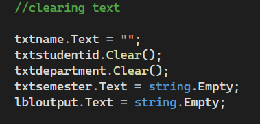

Chapter 1 – Student Information Practice

Overview

This practice demonstrates how to:

- Create variables
- Get data from TextBoxes
- Convert text to an integer
- Combine and display information
- Clear the form
- Exit the application

1. Creating Variables

Variables store the student's information:

- "name" → student's name
- "department" → student's department
- "semester" → student's semester
- "int studentid" → Student ID
- "=" → assigns a value

2. Getting Data from TextBoxes

- "txtname.Text" → gets the name
- "txtdepartment.Text" → gets the department
- "txtsemester.Text" → gets the semester

The values are stored in their variables.

3. Data Type Conversion

"int.Parse()" converts text into an integer.

studentid = int.Parse(txtstudentid.Text);

- "txtstudentid.Text" → gets the Student ID
- "int.Parse()" → converts it to integer

4. Concatenation

The "+" operator combines the student's information.

- "lbloutput.Text" → displays the result
- "name", "department", "semester", "studentid" → information displayed
- "+" → joins the values

5. Clearing

The Clear button removes the entered information and output.

txtname.Text = "";
txtstudentid.Clear();
txtdepartment.Clear();
txtsemester.Text = string.Empty;
lbloutput.Text = string.Empty;

6. Exit

- "btnexit_Click" → runs when Exit is clicked
- "Close();" → closes the application

Close();
